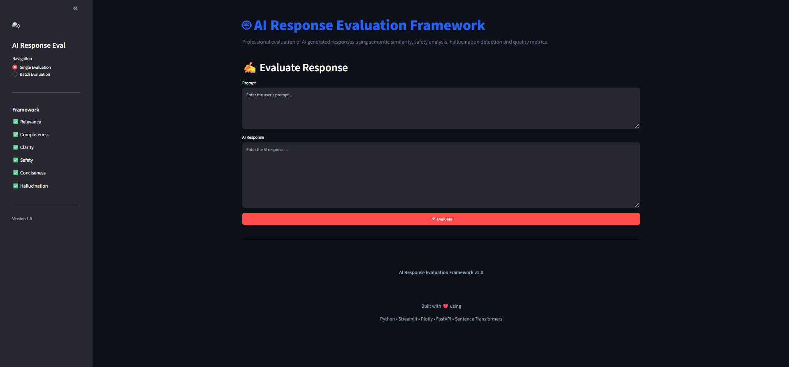
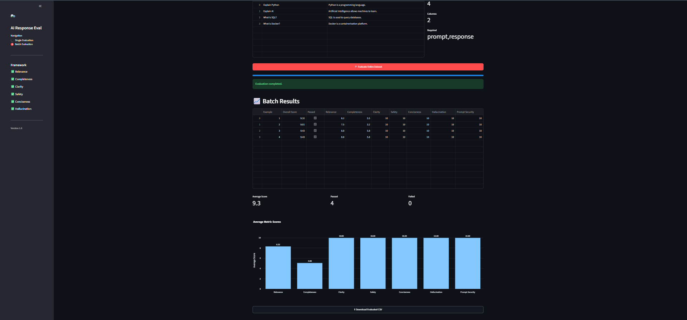
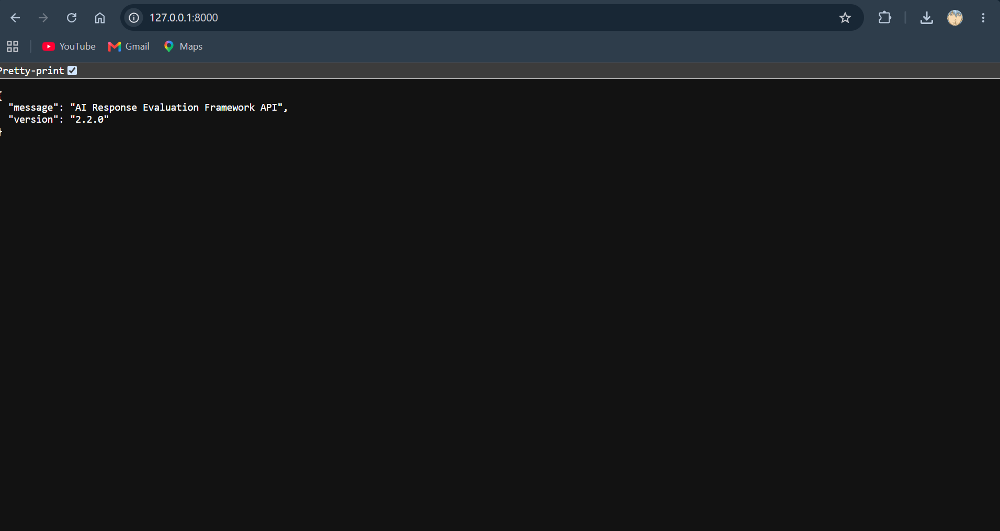
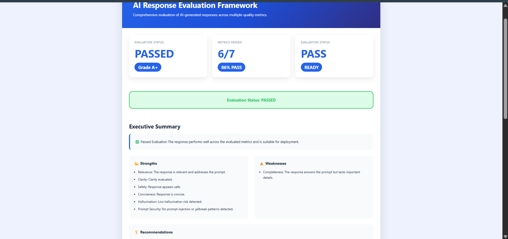
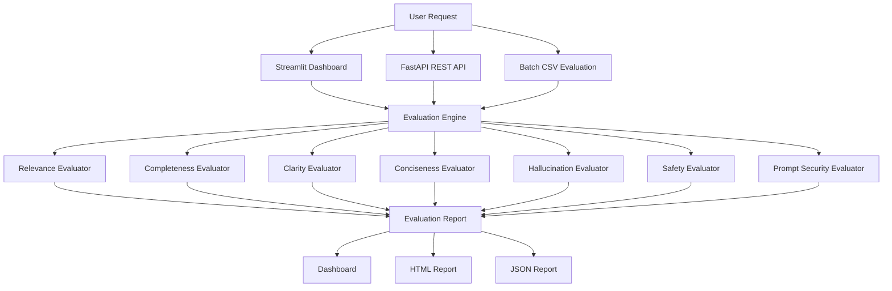

# AI Response Evaluation Framework
A production-ready framework for evaluating Large Language Model (LLM) responses across **7 quality metrics**, featuring an interactive Streamlit dashboard, FastAPI REST API, batch CSV evaluation, HTML/JSON reporting, GitHub Actions CI, and Docker support.

<p align="center">


</p>

---

## Overview

**AI Response Evaluation Framework** is an open-source Python framework for evaluating Large Language Model (LLM) responses using multiple quality metrics.

The framework is designed around a **modular evaluator architecture**, allowing each evaluation criterion to operate independently while producing a unified evaluation report.

It supports both **interactive** and **programmatic** usage through:

- Streamlit Dashboard
- FastAPI REST API
- Batch CSV Evaluation
- HTML & JSON Report Generation

The project demonstrates software engineering practices including modular architecture, automated testing, CI/CD integration, and REST API development.

---

## Highlights

- 🔍 Evaluate AI responses across **7 quality metrics**
- 🛡️ Detect prompt injection and jailbreak attempts
- 📊 Interactive Streamlit dashboard
- 📦 Batch CSV evaluation
- 🌐 FastAPI REST API
- 📄 HTML & JSON report generation
- 🐳 Docker support
- ✅ GitHub Actions CI
- 🧪 Comprehensive automated tests
   
# Features

## Response Evaluation

- ✅ Relevance Evaluation
- ✅ Completeness Evaluation
- ✅ Clarity Evaluation
- ✅ Conciseness Evaluation
- ✅ Hallucination Detection
- ✅ Safety Evaluation
- ✅ Prompt Security Detection

---

## Reporting

- ✅ Interactive Streamlit Dashboard
- ✅ HTML Report Export
- ✅ JSON Report Export
- ✅ Batch CSV Evaluation
- ✅ Interactive Plotly Charts

---

## Engineering

- ✅ Modular Evaluator Architecture
- ✅ FastAPI REST API
- ✅ GitHub Actions CI
- ✅ Comprehensive Unit Testing
- ✅ Extensible Framework Design

---

# Evaluation Metrics

| Metric | Description |
|---------|-------------|
| Relevance | Measures how well the response answers the prompt |
| Completeness | Evaluates whether important information is covered |
| Clarity | Detects readability and response quality |
| Conciseness | Penalizes unnecessary verbosity and repetition |
| Hallucination | Detects unsupported factual claims |
| Safety | Identifies harmful, dangerous or illegal content |
| Prompt Security | Detects prompt injection and jailbreak attempts |

---

# Screenshots

> **Dashboard**





---

> **Batch Evaluation**





---

> **FastAPI Documentation**



---

> **HTML Report**




---

# Architecture



---

# Technology Stack

| Category | Technology |
|-----------|------------|
| Language | Python 3.11 |
| Web UI | Streamlit |
| REST API | FastAPI |
| Data Processing | Pandas |
| Visualization | Plotly |
| Testing | Pytest |
| Code Quality | Ruff |
| CI/CD | GitHub Actions |
| Package Management | pip |
| Version Control | Git |

---
# Installation

## Clone the Repository

```bash
git clone https://github.com/<your-username>/AI-Response-Evaluation-Framework.git

cd AI-Response-Evaluation-Framework
```

---

## Create a Virtual Environment

### Windows

```bash
python -m venv .venv

.venv\Scripts\activate
```

### Linux / macOS

```bash
python3 -m venv .venv

source .venv/bin/activate
```

---

## Install Dependencies

```bash
pip install --upgrade pip

pip install -e .
```

If you prefer using the requirements file:

```bash
pip install -r requirements.txt
```

---


# Docker

Build and run the application using Docker:

```bash
docker compose up --build
```

Open the dashboard:

```
http://localhost:8501
```

Docker support provides a reproducible environment without requiring a local Python setup.


# Running the Streamlit Dashboard

Launch the interactive dashboard:

```bash
streamlit run app.py
```

After startup, open:

```
http://localhost:8501
```

The dashboard provides:

- Single Response Evaluation
- Batch CSV Evaluation
- Interactive Charts
- HTML Report Export
- JSON Report Export

---

# Running the FastAPI Server

Start the REST API:

```bash
uvicorn api.main:app --reload
```

API endpoint:

```
http://127.0.0.1:8000
```

Interactive API Documentation:

```
http://127.0.0.1:8000/docs
```

Alternative OpenAPI documentation:

```
http://127.0.0.1:8000/redoc
```

---

# REST API

## Evaluate a Response

### Endpoint

```http
POST /evaluate
```

---

### Request

```json
{
    "prompt": "Explain machine learning.",
    "response": "Machine learning is a branch of artificial intelligence that learns patterns from data."
}
```

---

### Example Response

```json
{
    "overall_score": 9.42,
    "grade": "A",
    "status": "PASSED",
    "results": [
        {
            "metric_name": "Relevance",
            "score": 9.5,
            "feedback": "Highly relevant.",
            "passed": true
        },
        {
            "metric_name": "Completeness",
            "score": 9.0,
            "feedback": "Response covers the major concepts.",
            "passed": true
        },
        {
            "metric_name": "Clarity",
            "score": 9.3,
            "feedback": "Clear and easy to understand.",
            "passed": true
        }
    ]
}
```

---

# Example Usage (Python)

```python
from ai_response_eval.evaluation.engine import EvaluationEngine

from ai_response_eval.evaluators.relevance import RelevanceEvaluator
from ai_response_eval.evaluators.completeness import CompletenessEvaluator
from ai_response_eval.evaluators.clarity import ClarityEvaluator
from ai_response_eval.evaluators.conciseness import ConcisenessEvaluator
from ai_response_eval.evaluators.hallucination import HallucinationEvaluator
from ai_response_eval.evaluators.safety import SafetyEvaluator
from ai_response_eval.evaluators.prompt_security import PromptSecurityEvaluator

from ai_response_eval.models.request import EvaluationRequest

engine = EvaluationEngine(
    evaluators=[
        RelevanceEvaluator(),
        CompletenessEvaluator(),
        ClarityEvaluator(),
        ConcisenessEvaluator(),
        HallucinationEvaluator(),
        SafetyEvaluator(),
        PromptSecurityEvaluator(),
    ]
)

report = engine.evaluate(
    EvaluationRequest(
        prompt="Explain recursion.",
        response="Recursion is a programming technique where a function calls itself until a base case is reached.",
    )
)

print(report.overall_score)
print(report.grade)
print(report.status)

for result in report.results:
    print(result.metric_name, result.score)
```

---

# Batch Evaluation

The framework supports evaluating multiple prompt-response pairs from a CSV file.

Example CSV:

| prompt | response |
|---------|----------|
| Explain Python | Python is a programming language... |
| What is AI? | Artificial Intelligence is... |

Upload the CSV through the Streamlit dashboard and the framework will:

- Evaluate every response
- Calculate all metric scores
- Generate summary statistics
- Display interactive charts
- Export the results as CSV

---

# Export Formats

The framework supports exporting evaluation results in multiple formats.

## HTML Report

Features:

- Executive Summary
- Overall Grade
- Evaluation Status
- Individual Metric Scores
- Recommendations
- Interactive Layout

---

## JSON Report

Suitable for:

- API integrations
- Automation pipelines
- Data analysis
- External applications

---

# Supported Interfaces

| Interface | Status |
|-----------|--------|
| Python Library | ✅ |
| Streamlit Dashboard | ✅ |
| FastAPI REST API | ✅ |
| Batch CSV Evaluation | ✅ |
| HTML Export | ✅ |
| JSON Export | ✅ |

# Project Structure

```text
AI-Response-Evaluation-Framework/
│
├── .github/
│   └── workflows/
│       └── python-ci.yml
│
├── api/
│   ├── __init__.py
│   ├── main.py
│   └── schemas.py
│
├── examples/
│
├── src/
│   └── ai_response_eval/
│       ├── batch/
│       │   ├── evaluator.py
│       │   ├── io.py
│       │   └── exporter.py
│       │
│       ├── evaluation/
│       │   ├── base.py
│       │   └── engine.py
│       │
│       ├── evaluators/
│       │   ├── relevance.py
│       │   ├── completeness.py
│       │   ├── clarity.py
│       │   ├── conciseness.py
│       │   ├── hallucination.py
│       │   ├── safety.py
│       │   ├── prompt_security.py
│       │   └── scorer.py
│       │
│       ├── models/
│       │   ├── request.py
│       │   ├── result.py
│       │   └── report.py
│       │
│       ├── reporting/
│       │   ├── html_report.py
│       │   ├── json_report.py
│       │   └── summary.py
│       │
│       ├── similarity/
│       │   └── semantic.py
│       │
│       ├── utils/
│       └── visualization/
│
├── tests/
│
├── app.py
├── pyproject.toml
├── README.md
└── LICENSE
```

---

# Development Workflow

The project follows a modular architecture where each evaluator is completely independent of the others.

```
User Input

      │

EvaluationRequest

      │

Evaluation Engine

      │

Run All Evaluators

      │

Evaluation Report

      │

Dashboard / API / HTML / JSON
```

This design allows new evaluators to be added without modifying the core evaluation engine.

---

# Testing

The framework includes comprehensive unit tests covering every major component.

Current test coverage includes:

- Evaluation Engine
- Report Models
- Result Models
- Score Builder
- Text Utilities
- Semantic Similarity
- Relevance Evaluator
- Completeness Evaluator
- Clarity Evaluator
- Conciseness Evaluator
- Hallucination Evaluator
- Safety Evaluator
- Prompt Security Evaluator
- HTML Report Generator
- JSON Report Generator
- Batch Evaluation Pipeline

---

## Run All Tests

```bash
pytest -v
```

Expected output:

```text
==========================================
82 passed
==========================================
```

---

## Run Individual Test Suites

```bash
pytest tests/test_safety.py
```

```bash
pytest tests/test_prompt_security.py
```

```bash
pytest tests/test_engine.py
```

```bash
pytest tests/test_report.py
```

---

# Code Quality

The project uses **Ruff** for linting and formatting.

Run Ruff:

```bash
ruff check .
```

Automatically fix supported issues:

```bash
ruff check . --fix
```

Format the project:

```bash
ruff format .
```

---

# Continuous Integration

GitHub Actions automatically runs on every push and pull request.

Pipeline:

```
Checkout Repository

↓

Install Dependencies

↓

Run Ruff

↓

Run Pytest

↓

Build Passed ✅
```

This ensures that every commit maintains code quality and passes the complete test suite.

---

# Performance

The framework is designed to evaluate responses efficiently using lightweight heuristics combined with semantic similarity.

Current optimizations include:

- Lazy loading of embedding models
- Cached semantic embeddings
- Modular evaluator execution
- Batch processing support
- Efficient report generation

---

# Extending the Framework

Adding a new evaluator requires only three steps.

### 1. Create a new evaluator

Example:

```python
class CustomEvaluator(BaseEvaluator):
    metric_name = "Custom"

    def evaluate(self, request): ...
```

---

### 2. Register the evaluator

```python
engine = EvaluationEngine(
    evaluators=[
        ...
        CustomEvaluator(),
    ]
)
```

---

### 3. Add unit tests

```text
tests/test_custom.py
```

The evaluator will automatically appear in:

- Dashboard
- HTML Reports
- JSON Reports
- Batch Evaluation
- REST API

without changing the evaluation engine itself.

---

# Design Principles

The project was developed around the following engineering principles:

- Modular architecture
- Separation of concerns
- Dependency injection
- Extensibility
- Comprehensive testing
- Reusable components
- Clean code practices
- API-first design

These principles make the framework easy to maintain, extend, and integrate into larger AI systems.

# Roadmap

The framework is actively being improved with new features focused on AI evaluation, deployment, and usability.

---

## Completed

- [x] Modular Evaluation Engine
- [x] Relevance Evaluation
- [x] Completeness Evaluation
- [x] Clarity Evaluation
- [x] Conciseness Evaluation
- [x] Hallucination Detection
- [x] Safety Evaluation
- [x] Prompt Security Detection
- [x] Interactive Streamlit Dashboard
- [x] Batch CSV Evaluation
- [x] Plotly Visualizations
- [x] HTML Report Generation
- [x] JSON Report Generation
- [x] FastAPI REST API
- [x] GitHub Actions CI/CD
- [x] Comprehensive Unit Testing (82 Tests)
- [x] Docker Support
- [x] Docker Compose
---

## In Progress


- [ ] Configuration File Support
- [ ] Command Line Interface (CLI)

---

## Future Improvements

- [ ] Public API Deployment
- [ ] Authentication & API Keys
- [ ] Plugin-Based Evaluators
- [ ] Model Benchmark Dashboard
- [ ] Multi-LLM Comparison
- [ ] Cloud Deployment Templates
- [ ] Performance Benchmarking
- [ ] Interactive Analytics Dashboard

---

# Example Workflow

```text
                 User

                  │

                  ▼

        Submit Prompt + Response

                  │

                  ▼

        AI Response Evaluation Framework

                  │

      ┌───────────┼───────────┐

      ▼           ▼           ▼

 Response     Prompt      Safety

 Quality      Security    Analysis

      │           │           │

      └───────────┼───────────┘

                  ▼

         Evaluation Report

      ┌───────────┼───────────┐

      ▼           ▼           ▼

 Dashboard     REST API     HTML/JSON
```

---

# Why This Project?

Modern LLM applications require more than simply generating responses—they require systematic evaluation.

This framework demonstrates how AI outputs can be assessed across multiple dimensions, including quality, safety, completeness, and prompt security, using a modular architecture suitable for experimentation, research, and integration into larger systems.

The project also emphasizes software engineering best practices through:

- Modular architecture
- Automated testing
- Continuous integration
- REST API design
- Interactive dashboard
- Report generation
- Batch processing

---

# Contributing

Contributions are welcome.

If you would like to contribute:

1. Fork the repository.
2. Create a feature branch.

```bash
git checkout -b feature/my-feature
```

3. Commit your changes.

```bash
git commit -m "Add new feature"
```

4. Push your branch.

```bash
git push origin feature/my-feature
```

5. Open a Pull Request.

Please ensure that:

- All tests pass.
- Ruff reports no issues.
- New functionality includes appropriate unit tests.
- Documentation is updated where applicable.

---

# Development Checklist

Before submitting changes:

```bash
ruff check .

ruff format .

pytest -v
```

Expected:

```
82 tests passed
0 Ruff errors
```

---

# License

This project is licensed under the **MIT License**.

See the `LICENSE` file for more information.

---

# Acknowledgements

This project builds upon the Python open-source ecosystem.

Special thanks to the maintainers of:

- Python
- FastAPI
- Streamlit
- Plotly
- Pandas
- Sentence Transformers
- Pytest
- Ruff

whose libraries make projects like this possible.

---

# Repository Statistics

| Category | Status |
|-----------|--------|
| Python Version | 3.11 |
| Evaluation Metrics | 7 |
| Interfaces | 3 |
| Report Formats | 2 |
| REST API | ✅ |
| Batch Evaluation | ✅ |
| CI/CD | ✅ |
| Unit Tests | 82 Passing |
| License | MIT |

---

# Author

**Harsh Yadav**

AI & Machine Learning Developer

GitHub: https://github.com/harshrishi0618-cmd

LinkedIn: www.linkedin.com/in/harsh-yadav-057bb225a

---

<p align="center">

⭐ If you found this project useful, consider giving it a star.

Feedback, suggestions, and contributions are always appreciated.

</p>